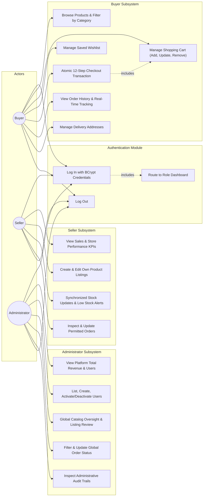

# System Use Case Diagram

This document illustrates the interactions between user actors (Buyer, Seller, Admin) and the MARTplus desktop system features.

---

## 1. Use Case Diagram (Mermaid)

```mermaid
flowchart LR
    subgraph Actors
        B((Buyer))
        S((Seller))
        A((Administrator))
    end

    subgraph Authentication_Module ["Authentication Module"]
        UC_Login["Log In with BCrypt Credentials"]
        UC_RoleRoute["Route to Role Dashboard"]
        UC_Logout["Log Out"]
    end

    subgraph Buyer_Module ["Buyer Subsystem"]
        UC_Browse["Browse Products & Filter by Category"]
        UC_Cart["Manage Shopping Cart (Add, Update, Remove)"]
        UC_Wishlist["Manage Saved Wishlist"]
        UC_Checkout["Atomic 12-Step Checkout Transaction"]
        UC_TrackOrder["View Order History & Real-Time Tracking"]
        UC_Addresses["Manage Delivery Addresses"]
    end

    subgraph Seller_Module ["Seller Subsystem"]
        UC_StoreMetrics["View Sales & Store Performance KPIs"]
        UC_ManageProducts["Create & Edit Own Product Listings"]
        UC_Inventory["Synchronized Stock Updates & Low Stock Alerts"]
        UC_FulfillOrders["Inspect & Update Permitted Orders"]
    end

    subgraph Admin_Module ["Administrator Subsystem"]
        UC_PlatformMetrics["View Platform Total Revenue & Users"]
        UC_ManageUsers["List, Create, Activate/Deactivate Users"]
        UC_CatalogOversight["Global Catalog Oversight & Listing Review"]
        UC_AllOrders["Filter & Update Global Order Status"]
        UC_AuditLogs["Inspect Administrative Audit Trails"]
    end

    %% Buyer Connections
    B --> UC_Login
    B --> UC_Browse
    B --> UC_Cart
    B --> UC_Wishlist
    B --> UC_Checkout
    B --> UC_TrackOrder
    B --> UC_Addresses
    B --> UC_Logout

    %% Seller Connections
    S --> UC_Login
    S --> UC_StoreMetrics
    S --> UC_ManageProducts
    S --> UC_Inventory
    S --> UC_FulfillOrders
    S --> UC_Logout

    %% Admin Connections
    A --> UC_Login
    A --> UC_PlatformMetrics
    A --> UC_ManageUsers
    A --> UC_CatalogOversight
    A --> UC_AllOrders
    A --> UC_AuditLogs
    A --> UC_Logout

    %% System Inclusions
    UC_Login -.->|includes| UC_RoleRoute
    UC_Checkout -.->|includes| UC_Cart
```
